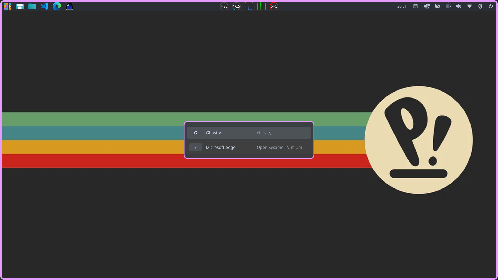
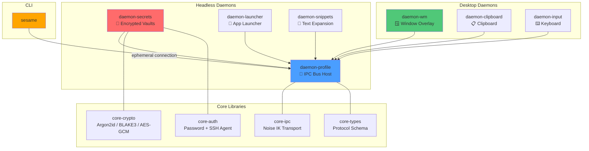

# Open Sesame

An Alt+Tab replacement, application launcher, and secret manager for Linux.

<div align="center">

[](LICENSE)
[](https://github.com/ScopeCreep-zip/open-sesame/releases)
[](https://github.com/ScopeCreep-zip/open-sesame/actions/workflows/test.yml)
[](https://slsa.dev)

[Quick Start](#-quick-start) · [Features](#-features) · [How It Works](#-how-it-works) · [Usage](#-usage) · [Configuration](#-configuration) · [Architecture](#-architecture)

</div>



Open Sesame replaces your Alt+Tab with a window switcher that shows letter hints on every window. Tap `Alt+Tab` to quick-switch to your previous window, or hold it to see all your windows and type a letter to jump directly. `Alt+Shift+Tab` cycles backward. `Alt+Space` opens the full launcher overlay where you can also fuzzy-search and launch applications. All key combos are configurable.

Each window can be bound to a letter in your config. If the app is already open, that letter focuses it. If it's not running, it launches it. Multiple windows of the same app get stacked hints: `g`, `gg`, `ggg`. You configure which apps map to which letters, what command to run if the app isn't open, and optionally which secrets and environment variables to inject at launch time.

Beyond window switching, Open Sesame manages encrypted secret vaults with per-profile trust boundaries, clipboard history with sensitivity detection, keyboard input capture for compositor-independent shortcuts, and text snippet expansion. Secrets can be injected into any command as environment variables (`sesame env -p work -- aws s3 ls`) or exported in shell, dotenv, or JSON format. Vault unlock supports passwords, SSH agent keys, or both with configurable auth policies.

Everything is scoped to trust profiles. A "work" profile has its own vault, its own secrets, its own clipboard history, its own frecency ranking, and its own launch configurations -- completely separate from "personal" or "default". Profiles activate based on context (WiFi network, connected hardware) or manually.

The system runs as seven cooperating daemons under systemd, communicating over a Noise IK encrypted IPC bus. Each daemon is sandboxed with Landlock filesystem restrictions and seccomp syscall filtering. The whole thing is controlled through one CLI: `sesame`.

### 📦 Two packages

**`open-sesame`** -- headless core
> `sesame` CLI, daemon-profile, daemon-secrets, daemon-launcher, daemon-snippets
>
> Runs anywhere with systemd: desktops, servers, containers, VMs.

**`open-sesame-desktop`** -- GUI layer (depends on `open-sesame`)
> daemon-wm, daemon-clipboard, daemon-input
>
> Requires a COSMIC or Wayland desktop.

Install `open-sesame-desktop` and it pulls in `open-sesame` automatically. On a server or in a container, install just `open-sesame` for encrypted secrets and application launching without any GUI dependencies.

---

## 🚀 Quick Start

Add the GPG key:

```bash
curl -fsSL https://scopecreep-zip.github.io/open-sesame/gpg.key | sudo gpg --dearmor -o /usr/share/keyrings/open-sesame.gpg
```

Add the APT repository:

```bash
echo "deb [signed-by=/usr/share/keyrings/open-sesame.gpg] https://scopecreep-zip.github.io/open-sesame noble main" | sudo tee /etc/apt/sources.list.d/open-sesame.list
```

Install on a desktop:

```bash
sudo apt update && sudo apt install -y open-sesame open-sesame-desktop
```

Or install headless only (servers, containers, VMs -- no GUI dependencies):

```bash
sudo apt update && sudo apt install -y open-sesame
```

All daemons start automatically after install. Run `sesame init` to create your config directory, generate IPC keypairs, and set a master password for your first vault:

```bash
sesame init
```

```bash
sesame status
```

Press `Alt+Tab` to switch windows. Press `Alt+Space` to open the launcher overlay. Configure your key bindings in `~/.config/pds/config.toml` (see [Configuration](#-configuration) below).

---

## ✨ Features

<table>
<tr>
<td width="50%" valign="top">

### 🪟 Window Switching

- Full Alt+Tab replacement with MRU forward and backward
- Letter hints on every window (Vimium-style)
- Quick-switch on fast tap, full overlay on hold
- Focus-or-launch: type a letter to focus or start an app
- Arrow key navigation as an alternative to letters
- Stacked hints for multiple instances: `g`, `gg`, `ggg`
- Configurable key combos, delays, colors, and theming
- Native Wayland layer-shell overlay with COSMIC theming
- Sub-200ms activation with staged commit model

### 🔐 Encrypted Vaults

- Per-profile SQLCipher-encrypted databases (AES-256-CBC + HMAC-SHA512)
- Multi-factor unlock: password (Argon2id), SSH agent (Ed25519/RSA), or both
- Auth policies: `any` (either factor), `all` (every factor required), or threshold
- Secrets injected as environment variables at launch time
- Export as shell eval, dotenv, or JSON
- mlock'd key material with zeroize-on-drop -- never hits swap or core dumps
- Rate-limited unlock attempts to prevent brute-force
- Hash-chained BLAKE3 audit log for all vault operations

</td>
<td width="50%" valign="top">

### 🚀 Application Launcher

- Fuzzy search with nucleo-powered matching and frecency ranking
- Automatic desktop entry discovery from XDG directories
- Secret and environment variable injection at launch time
- Nix devshell wrapping via composable launch profiles
- systemd-scoped child processes survive launcher restarts
- Cross-profile composable launch tags (`work:corp`)

### 📋 Also Included

- **Clipboard** -- Per-profile history with sensitivity detection and configurable TTL auto-expiry (desktop)
- **Input** -- Compositor-independent keyboard capture via evdev with XKB keysym translation (desktop)
- **Snippets** -- Text expansion triggers scoped to trust profiles
- **Workspaces** -- Canonical paths (`/workspace/<user>/<server>/<org>/<repo>`), git-aware cloning, profile linking, shell injection
- **Audit** -- BLAKE3 tamper-evident hash chain, `sesame audit verify` detects modifications/deletions/reorderings
- **Profiles** -- Trust boundaries that scope everything above -- secrets, clipboard, frecency, snippets, audit, launch configs

### 🛡️ Platform

- Two-package split with automatic systemd user service lifecycle
- COSMIC keybinding integration via `sesame setup-keybinding`
- Nix flake with overlay and home-manager module (`headless` option)
- GPG-signed APT repository with SLSA build provenance attestations
- Landlock + seccomp sandbox per daemon, systemd hardening directives
- macOS and Windows platform crates scaffolded for future support

</td>
</tr>
</table>

---

## 🎯 How It Works

<table>
<tr>
<td width="50%" valign="top">

### Alt+Tab (Switcher Mode)

Works like traditional Alt+Tab but with letter hints visible for instant selection.

**Tap** -- instantly switch to your previous window. If you release Alt within 250ms (configurable), the overlay never appears and the switch is committed.

**Hold** -- the overlay fades in after 150ms (configurable) showing all windows with hints. Type a letter to jump, or use arrows to navigate. Release Alt to commit the selection.

**Alt+Shift+Tab** -- cycle backward through the MRU stack.

</td>
<td width="50%" valign="top">

### Alt+Space (Launcher Mode)

Opens the full overlay immediately with all windows, letter hints, and a search field.

Type a letter to jump to a window. Keep typing to fuzzy-search installed applications. If no window matches, the matched application launches with your configured secrets, env vars, and optionally inside a Nix devshell.

Key bindings configured in `config.toml` determine which letter maps to which app. If the app isn't running, the `launch` command starts it. Tags compose environment from multiple launch profiles, even across trust profile boundaries.

</td>
</tr>
</table>

### ⌨️ Overlay Keyboard Shortcuts

| Key | Action |
|-----|--------|
| Letter keys | Jump to the window with that hint |
| Arrow keys | Navigate through window list |
| Enter | Activate selected window |
| Escape | Cancel and return to origin window |
| Repeat letter | `gg`, `ggg` for multiple windows with the same hint |
| Alt release | Commit the current selection |

All timing parameters (overlay delay, activation delay, quick-switch threshold) are configurable per profile. See the [WM configuration](#-configuration) section below.

---

## 📥 Installation

<details>
<summary><b>🔹 APT Repository (recommended for Pop!_OS / Ubuntu)</b></summary>

Add the GPG key:

```bash
curl -fsSL https://scopecreep-zip.github.io/open-sesame/gpg.key | sudo gpg --dearmor -o /usr/share/keyrings/open-sesame.gpg
```

Add the repository:

```bash
echo "deb [signed-by=/usr/share/keyrings/open-sesame.gpg] https://scopecreep-zip.github.io/open-sesame noble main" | sudo tee /etc/apt/sources.list.d/open-sesame.list
```

Install desktop (full suite):

```bash
sudo apt update && sudo apt install -y open-sesame open-sesame-desktop
```

Or install headless only (servers, containers, VMs):

```bash
sudo apt update && sudo apt install -y open-sesame
```

Initialize:

```bash
sesame init
```

The `open-sesame` package installs 5 binaries and systemd user services under `open-sesame-headless.target` (WantedBy `default.target`). The `open-sesame-desktop` package adds 3 GUI daemons under `open-sesame-desktop.target` (Requires `graphical-session.target`). Package postinst scripts handle `systemctl --global enable` and per-user service activation automatically -- no manual `systemctl` commands needed.

</details>

<details>
<summary><b>🔹 GitHub Releases (direct download)</b></summary>

Download both packages:

```bash
ARCH=$(uname -m)
curl -fsSL "https://github.com/ScopeCreep-zip/open-sesame/releases/latest/download/open-sesame-linux-${ARCH}.deb" -o /tmp/open-sesame.deb
curl -fsSL "https://github.com/ScopeCreep-zip/open-sesame/releases/latest/download/open-sesame-desktop-linux-${ARCH}.deb" -o /tmp/open-sesame-desktop.deb
```

Verify build provenance ([SLSA](https://slsa.dev/)):

```bash
gh attestation verify /tmp/open-sesame.deb --owner ScopeCreep-zip
```

```bash
gh attestation verify /tmp/open-sesame-desktop.deb --owner ScopeCreep-zip
```

Install (headless first, then desktop):

```bash
sudo dpkg -i /tmp/open-sesame.deb /tmp/open-sesame-desktop.deb
```

Initialize:

```bash
sesame init
```

</details>

<details>
<summary><b>🔹 Nix Flake (NixOS / home-manager)</b></summary>

Add the flake input:

```nix
# flake.nix
{
  inputs.open-sesame = {
    url = "github:ScopeCreep-zip/open-sesame";
    inputs.nixpkgs.follows = "nixpkgs";
  };
}
```

Enable the home-manager module:

```nix
# home configuration
{ open-sesame, ... }:
{
  imports = [ open-sesame.homeManagerModules.default ];

  programs.open-sesame = {
    enable = true;
    # headless = true;  # servers/containers: omit desktop daemons
    settings = {
      key_bindings.g = {
        apps = [ "ghostty" "com.mitchellh.ghostty" ];
        launch = "ghostty";
        tags = [ "dev" "work:corp" ];
      };
      key_bindings.f = {
        apps = [ "firefox" "org.mozilla.firefox" ];
        launch = "firefox";
      };
      key_bindings.z = {
        apps = [ "zed" "dev.zed.Zed" ];
        launch = "zed-editor";
      };
    };
    profiles = {
      default = {
        launch_profiles.dev = {
          env = { RUST_LOG = "debug"; };
          secrets = [ "github-token" ];
        };
      };
      work = {
        launch_profiles.corp = {
          env = { CORP_ENV = "production"; };
          secrets = [ "corp-api-key" ];
        };
      };
    };
  };
}
```

The module generates `~/.config/pds/config.toml`, creates systemd user services with dual targets (`open-sesame-headless.target` always, `open-sesame-desktop.target` when `headless = false`), configures `SSH_AUTH_SOCK` for SSH agent forwarding, and sets up tmpfiles.d rules for runtime directories.

Available Nix packages:

| Package | Description |
|---------|-------------|
| `packages.open-sesame` | Headless: 5 binaries, no GUI deps (`openssl` + `libseccomp` only) |
| `packages.open-sesame-desktop` | Desktop: 3 GUI daemons + CLI with keybinding commands (propagates headless) |
| `packages.default` | Desktop (alias) |

</details>

<details>
<summary><b>🔹 Building from Source</b></summary>

#### Nix (recommended)

The flake provides a complete dev environment with all native dependencies:

```bash
nix develop
```

```bash
cargo check --workspace
```

#### Debian/Ubuntu/Pop!_OS

Install system library headers:

```bash
sudo apt-get install -y build-essential pkg-config libssl-dev libseccomp-dev libwayland-dev libxkbcommon-dev libfontconfig1-dev
```

```bash
cargo check --workspace
```

Minimum Rust toolchain: see `rust-toolchain.toml`.

#### What each system package provides

| apt package | Crate(s) | Purpose |
|---|---|---|
| `libssl-dev` | `rusqlite` (bundled-sqlcipher) | OpenSSL for SQLCipher encryption |
| `libseccomp-dev` | `libseccomp` | seccomp-bpf syscall filtering |
| `libwayland-dev` | `wayland-client`, `smithay-client-toolkit` | Wayland protocol for overlay and clipboard |
| `libxkbcommon-dev` | `xkbcommon` | Keyboard keymap handling |
| `libfontconfig1-dev` | `fontconfig` | Font discovery for overlay rendering |

</details>

---

## 💻 Usage

<table>
<tr>
<td width="50%" valign="top">

### 🏁 Getting Started

```bash
# First-time setup
sesame init

# With organization namespace
sesame init --org braincraft.io

# SSH-only vault
sesame init --ssh-key

# Dual-factor vault (password + SSH)
sesame init --ssh-key --password

# Dual-factor, all factors required
sesame init --ssh-key --password --auth-policy all

# Specific SSH key
sesame init --ssh-key ~/.ssh/id_ed25519.pub

# Factory reset
sesame init --wipe-reset-destroy-all-data

# Check status
sesame status
```

### 🔓 Vault Operations

```bash
# Unlock (auto-tries SSH agent, then password)
sesame unlock
sesame unlock -p work
sesame unlock -p "default,work"

# Lock (zeroizes cached key material)
sesame lock
sesame lock -p work
```

### 🔑 SSH Agent Unlock

```bash
# Enroll (interactive selection from agent)
sesame ssh enroll -p default

# Enroll specific key
sesame ssh enroll -p work -k SHA256:abc123...
sesame ssh enroll -p work -k ~/.ssh/id_ed25519.pub

# List and revoke
sesame ssh list
sesame ssh revoke -p work
```

After enrollment, unlock and the window switcher overlay attempt SSH agent unlock automatically before falling back to password.

### 🗝️ Secret Management

```bash
# Store (prompts for value)
sesame secret set -p default github-token

# Retrieve
sesame secret get -p default github-token

# List keys (never shows values)
sesame secret list -p work

# Delete
sesame secret delete -p work old-key
sesame secret delete -p work old-key --yes
```

</td>
<td width="50%" valign="top">

### 🌍 Environment Injection

```bash
# Run with secrets as env vars
sesame env -p work -- aws s3 ls

# With prefix (api-key -> MYAPP_API_KEY)
sesame env -p work --prefix MYAPP -- ./start.sh

# Multi-profile
sesame env -p "default,work" -- make deploy
```

A runtime denylist blocks injection of `LD_PRELOAD`, `BASH_ENV`, `NODE_OPTIONS`, `PYTHONSTARTUP`, `JAVA_TOOL_OPTIONS`, and 30+ other vectors.

### 📤 Secret Export

```bash
# Shell eval (bash/zsh/direnv)
eval "$(sesame export -p work)"

# Dotenv (Docker/node/python-dotenv)
sesame export -p work -f dotenv > .env.secrets

# JSON (jq/CI/CD)
sesame export -p work -f json | jq .

# With prefix
sesame export -p work --prefix MYAPP -f shell
```

### 🪟 Window Manager

```bash
sesame wm overlay
sesame wm overlay --launcher
sesame wm overlay --backward
sesame wm switch
sesame wm switch --backward
sesame wm focus firefox
sesame wm list
```

### 🔍 Application Launcher

```bash
sesame launch search firefox
sesame launch search "visual studio" -n 5
sesame launch run org.mozilla.firefox
sesame launch run org.mozilla.firefox -p work
```

### 👤 Profiles

```bash
sesame profile list
sesame profile show work
sesame profile activate work
sesame profile deactivate work
sesame profile default work
```

### 📂 Workspaces

```bash
sesame workspace init
sesame workspace clone https://github.com/org/repo
sesame workspace clone git@github.com:org/repo --depth 1
sesame workspace link -p work
sesame workspace list
sesame workspace status
sesame workspace shell
sesame workspace shell -p work -- make build
sesame workspace config show
sesame workspace unlink
```

### 📋 Clipboard, Input, Snippets, Audit

```bash
sesame clipboard history -p default -n 50
sesame clipboard clear -p work
sesame clipboard get <entry-id>

sesame input layers
sesame input status

sesame snippet list -p default
sesame snippet add -p default "@@sig" "Best,\nJohn"
sesame snippet expand -p default "@@sig"

sesame audit verify
sesame audit tail -n 50 -f
```

### ⌨️ COSMIC Keybindings

```bash
sesame setup-keybinding
sesame setup-keybinding super+space
sesame keybinding-status
sesame remove-keybinding
```

</td>
</tr>
</table>

---

## ⚙️ Configuration

Open Sesame uses `~/.config/pds/config.toml` with layered inheritance:

```text
/etc/pds/policy.toml              # System policy (enterprise, read-only)
~/.config/pds/config.toml         # User config
~/.config/pds/config.d/*.toml     # Drop-in fragments (alphabetical)
~/.config/pds/workspaces.toml     # Workspace-to-profile links
~/.config/pds/installation.toml   # Installation identity (generated by sesame init)
```

Data locations:

```text
~/.config/pds/vaults/             # Encrypted SQLCipher vault databases
~/.config/pds/keys/               # Noise IK daemon keypairs
~/.config/pds/enrollments/        # SSH key enrollment blobs
~/.config/pds/audit.jsonl         # Hash-chained audit log
$XDG_RUNTIME_DIR/pds/             # Runtime: IPC socket, bus public key
```

<details>
<summary><b>📄 Full example configuration</b></summary>

```toml
config_version = 3

[global]
default_profile = "default"

[global.ipc]
# channel_capacity = 1024
# slow_subscriber_timeout_ms = 5000

[global.logging]
level = "info"
# json = false
# journald = true

# ── Profile: default ──────────────────────────────────────────────

[profiles.default]
name = "default"

# Authentication: how vault unlock factors combine
# "any"    — any single enrolled factor unlocks (password OR ssh-agent)
# "all"    — all enrolled factors required (BLAKE3 combined key)
# "policy" — required factors + threshold of additional enrolled factors
[profiles.default.auth]
mode = "any"
# required = ["password", "ssh-agent"]  # for mode = "policy"
# additional_required = 0               # for mode = "policy"

# Window Manager settings
[profiles.default.wm]
hint_keys = "asdfghjkl"
overlay_delay_ms = 150          # ms before full overlay appears
activation_delay_ms = 200       # ms delay before committing a hint match
quick_switch_threshold_ms = 250 # Alt+Tab released within this = instant switch
border_width = 4.0
border_color = "#89b4fa"
background_color = "#000000c8"
card_color = "#1e1e1ef0"
text_color = "#ffffff"
hint_color = "#646464"
hint_matched_color = "#4caf50"
show_title = true
show_app_id = false
max_visible_windows = 20

# ── Key Bindings ──────────────────────────────────────────────────
# Each section maps a letter to app IDs and an optional launch command.
# Multiple windows of the same app get repeated keys: g, gg, ggg
# Find your app_ids: sesame wm list

# Terminals
[profiles.default.wm.key_bindings.g]
apps = ["ghostty", "com.mitchellh.ghostty"]
launch = "ghostty"

# Browsers
[profiles.default.wm.key_bindings.f]
apps = ["firefox", "org.mozilla.firefox", "Firefox"]
launch = "firefox"

[profiles.default.wm.key_bindings.e]
apps = ["microsoft-edge", "com.microsoft.Edge", "Microsoft-edge"]
launch = "microsoft-edge"

[profiles.default.wm.key_bindings.v]
apps = ["vivaldi", "vivaldi-stable"]
launch = "vivaldi"

[profiles.default.wm.key_bindings.c]
apps = ["chromium", "google-chrome", "Chromium", "Google-chrome"]
# No launch — focus only

# Editors
[profiles.default.wm.key_bindings.z]
apps = ["zed", "dev.zed.Zed"]
launch = "zed-editor"

# File Managers
[profiles.default.wm.key_bindings.n]
apps = ["nautilus", "org.gnome.Nautilus", "com.system76.CosmicFiles"]
launch = "nautilus"

# Communication
[profiles.default.wm.key_bindings.s]
apps = ["slack", "Slack"]
launch = "slack"

[profiles.default.wm.key_bindings.d]
apps = ["discord", "Discord"]
launch = "discord"

[profiles.default.wm.key_bindings.t]
apps = ["thunderbird", "Thunderbird"]
launch = "thunderbird"

# Media
[profiles.default.wm.key_bindings.m]
apps = ["spotify", "Spotify"]
launch = "spotify"

# ── Launch Profiles ───────────────────────────────────────────────
# Named, composable environment bundles applied via the `tags` field on
# key bindings. Tags support cross-profile references: "work:corp" resolves
# the "corp" launch profile in the "work" trust profile.
#
# When multiple tags are applied, env vars merge (later tag wins on conflict),
# secrets accumulate, and last devshell/cwd wins.

[profiles.default.launch_profiles.dev]
env = { RUST_LOG = "debug" }
secrets = ["github-token"]
# devshell = "/workspace/myproject#rust"
# cwd = "/workspace/usrbinkat/github.com/org/repo"

# Launcher settings
[profiles.default.launcher]
max_results = 20
frecency = true

# Clipboard settings
[profiles.default.clipboard]
max_history = 1000
sensitive_ttl_s = 30
detect_sensitive = true

# Audit settings
[profiles.default.audit]
enabled = true
retention_days = 90

# ── Profile: work (example) ──────────────────────────────────────

# [profiles.work]
# name = "work"
#
# [profiles.work.auth]
# mode = "all"
#
# [profiles.work.launch_profiles.corp]
# env = { CORP_ENV = "production" }
# secrets = ["corp-api-key", "corp-signing-key"]
# cwd = "/workspace/usrbinkat/github.com/acme-corp"
#
# # Tag a key binding with a cross-profile launch profile:
# # [profiles.default.wm.key_bindings.g]
# # apps = ["ghostty"]
# # launch = "ghostty"
# # tags = ["dev", "work:corp"]
# #
# # This composes: "dev" from default + "corp" from work profile.
# # Environment merges, secrets accumulate, last devshell/cwd wins.

# ── Cryptographic Algorithms ──────────────────────────────────────

[crypto]
kdf = "argon2id"             # or "pbkdf2-sha256"
hkdf = "blake3"              # or "hkdf-sha256"
noise_cipher = "chacha-poly" # or "aes-gcm"
noise_hash = "blake2s"       # or "sha256"
audit_hash = "blake3"        # or "sha256"
minimum_peer_profile = "leading-edge"  # or "governance-compatible", "custom"
```

</details>

<details>
<summary><b>🔗 Advanced: launch profiles with cross-profile tags</b></summary>

Launch profiles let you compose environment variables, secrets, and Nix devshells from multiple trust boundaries at launch time:

```toml
# Tag a key binding with launch profiles from multiple trust boundaries
[profiles.default.wm.key_bindings.g]
apps = ["ghostty"]
launch = "ghostty"
tags = ["dev-rust", "work:corp"]
launch_args = ["--working-directory=/workspace/user/github.com/org/repo"]

[profiles.default.launch_profiles.dev-rust]
env = { RUST_LOG = "debug", CARGO_HOME = "/workspace/.cargo" }
secrets = ["github-token", "crates-io-token"]
devshell = "/workspace/myproject#rust"
cwd = "/workspace/user/github.com/org/repo"

# "work:corp" references the "corp" launch profile in the "work" trust profile.
# When multiple tags are applied:
#   - env vars merge (later tag wins on conflict)
#   - secrets accumulate (union of all tags)
#   - last devshell/cwd wins
```

</details>

<details>
<summary><b>📁 Per-directory configuration (.sesame.toml)</b></summary>

Place a `.sesame.toml` in any workspace or repo root for directory-scoped defaults:

```toml
# Default profile when working in this directory
profile = "work"

# Environment variables (non-secret)
[env]
RUST_LOG = "debug"
PROJECT_NAME = "my-project"

# Launch profile tags applied automatically
tags = ["dev-rust"]

# Prefix for secret injection
secret_prefix = "MYAPP"
```

</details>

<details>
<summary><b>🗂️ Workspace configuration (~/.config/pds/workspaces.toml)</b></summary>

```toml
[settings]
root = "/workspace"
default_ssh = true

[links]
"/workspace/usrbinkat/github.com/corp" = "work"
"/workspace/usrbinkat/github.com/personal" = "default"
```

</details>

---

## 🔧 Troubleshooting

<details>
<summary><b>Daemons not running</b></summary>

```bash
sesame status
```

```bash
systemctl --user list-units "open-sesame-*"
```

```bash
journalctl --user -u open-sesame-profile -f
```

```bash
journalctl --user -u open-sesame-wm -f
```

```bash
journalctl --user -u open-sesame-secrets -f
```

</details>

<details>
<summary><b>No windows in overlay</b></summary>

```bash
sesame wm list
```

Requires COSMIC or a Wayland compositor with `ext-foreign-toplevel` protocol support. X11 is not supported.

</details>

<details>
<summary><b>Wrong app IDs in config</b></summary>

```bash
sesame wm list
```

Copy the exact `app_id` shown and use it in your `key_bindings` configuration.

</details>

<details>
<summary><b>Keybinding not working</b></summary>

```bash
sesame keybinding-status
```

```bash
sesame remove-keybinding && sesame setup-keybinding
```

Check for conflicts with other COSMIC shortcuts.

</details>

<details>
<summary><b>SSH agent unlock not working</b></summary>

```bash
ssh-add -l
```

```bash
sesame ssh list -p default
```

If no enrollment exists, unlock with password first then enroll:

```bash
sesame unlock -p default
```

```bash
sesame ssh enroll -p default
```

For SSH agent forwarding on remote VMs, ensure `SSH_AUTH_SOCK` is available to systemd user services. The home-manager module handles this via `~/.ssh/agent.sock` stable symlink.

</details>

<details>
<summary><b>Input daemon requires input group</b></summary>

`daemon-input` needs `/dev/input/*` access for keyboard capture when no window is focused:

```bash
sudo usermod -aG input $USER
```

Logout and login required.

</details>

<details>
<summary><b>Debug logging</b></summary>

```bash
systemctl --user set-environment RUST_LOG=debug
```

```bash
systemctl --user restart open-sesame-headless.target
```

```bash
systemctl --user restart open-sesame-desktop.target
```

```bash
journalctl --user -u open-sesame-profile -f
```

Or run a single daemon manually:

```bash
systemctl --user stop open-sesame-wm
```

```bash
RUST_LOG=debug daemon-wm
```

</details>

<details>
<summary><b>Overlay feels slow</b></summary>

Reduce delays in your config:

```toml
[profiles.default.wm]
overlay_delay_ms = 0       # Show immediately
activation_delay_ms = 100  # Faster activation (may skip gg/ggg disambiguation)
```

</details>

---

## 🏗️ Architecture

Open Sesame is 21 Rust crates organized as seven daemons, eight core libraries, and six platform/tooling crates, communicating over a Noise IK encrypted IPC bus.



### 🔌 IPC Bus

All daemons communicate through `daemon-profile` which hosts a Noise IK encrypted bus on `$XDG_RUNTIME_DIR/pds/bus.sock`. Every connection is authenticated with X25519 key exchange and ChaChaPoly AEAD. Peer identity is bound via kernel UCred (PID, UID) in the Noise prologue. Messages are postcard-encoded with security level enforcement -- a daemon can only send messages at or below its registered clearance level.

### 🎯 Systemd Targets

The two targets compose cleanly:

| Target | WantedBy | Daemons |
|--------|----------|---------|
| `open-sesame-headless.target` | `default.target` | profile, secrets, launcher, snippets |
| `open-sesame-desktop.target` | `graphical-session.target` | wm, clipboard, input |

The desktop target `Requires` the headless target. Starting desktop starts headless first. Stopping desktop leaves headless running. All daemons use `Type=notify` with `WatchdogSec=30` for health monitoring.

### 🗝️ Key Hierarchy

```text
Password --> Argon2id(password, per-profile-salt) --> Master Key (32 bytes, mlock'd)
  |
  +--> BLAKE3 derive_key("pds v2 vault-key {profile}")          --> SQLCipher page key
  +--> BLAKE3 derive_key("pds v2 clipboard-key {profile}")       --> Clipboard encryption key
  +--> BLAKE3 derive_key("pds v2 ipc-auth-token {profile}")      --> IPC auth token
  +--> BLAKE3 derive_key("pds v2 ipc-encryption-key {profile}")  --> IPC field encryption key

SSH Agent (alternative/additional factor):
  SSH sign(challenge) --> BLAKE3 derive_key("pds v2 ssh-vault-kek {profile}") --> KEK
    KEK wraps Master Key via AES-256-GCM --> EnrollmentBlob on disk

All-mode (both factors required):
  BLAKE3 derive_key("pds v2 combined-master-key {profile}", sorted_factor_pieces)
    --> Combined Key
```

<details>
<summary><b>📚 Core libraries and platform crates</b></summary>

| Crate | Purpose |
|-------|---------|
| `core-ipc` | Noise IK transport (X25519 + ChaChaPoly + BLAKE2s), BusServer/BusClient, clearance registry, postcard framing, UCred binding |
| `core-types` | Canonical type system: `EventKind` protocol schema, `DaemonId`, `SecurityLevel`, `TrustProfileName`, `SensitiveBytes` with mlock |
| `core-crypto` | Argon2id KDF, BLAKE3 HKDF, AES-256-GCM encryption, `SecureBytes`/`SecureVec` with mlock + zeroize-on-drop |
| `core-config` | TOML configuration schema with XDG layered inheritance, inotify hot-reload watcher, config validation |
| `core-auth` | Multi-factor authentication: `PasswordBackend` (Argon2id KEK wrapping), `SshAgentBackend` (deterministic signature KEK), `AuthDispatcher`, `VaultMetadata` persistence |
| `core-secrets` | SQLCipher database abstraction, `KeyLocker` trait, JIT secret cache |
| `core-profile` | Profile context evaluation, hash-chained BLAKE3 audit logger |
| `core-fuzzy` | Nucleo fuzzy matching engine with frecency scoring backed by SQLite |
| `platform-linux` | Wayland/COSMIC compositor backends (`CosmicBackend`, `WlrBackend`), Landlock sandbox, seccomp-bpf, D-Bus (SSID monitor, Secret Service), COSMIC key injection, systemd notify |
| `sesame-workspace` | Workspace discovery, canonical path convention, git operations, platform-specific root resolution |
| `extension-host` | WASI extension runtime (Wasmtime + component model) |
| `extension-sdk` | Extension development SDK (WIT bindings) |
| `platform-macos` | macOS platform abstractions (scaffolded: accessibility, keychain, launch agents) |
| `platform-windows` | Windows platform abstractions (scaffolded: credential vault, hotkeys, UI automation) |

</details>

<details>
<summary><b>🛡️ Security model</b></summary>

- **Noise IK encrypted IPC** -- All inter-daemon communication authenticated and encrypted with forward secrecy
- **SQLCipher encrypted vaults** -- AES-256-CBC with HMAC-SHA512 per page, Argon2id key derivation (19 MiB memory, 2 iterations)
- **SSH agent unlock** -- Master key wrapped under KEK derived from deterministic SSH signatures (Ed25519/RSA PKCS#1 v1.5)
- **mlock'd key material** -- `SecureBytes` and `SecureVec` use `mlock(2)` to prevent swap exposure, `MADV_DONTDUMP` to exclude from core dumps, and zeroize all bytes on drop
- **Landlock filesystem sandboxing** -- Per-daemon path-based access control. Daemons can only access their specific runtime directories. Partially enforced Landlock is treated as a fatal error -- no degradation
- **seccomp-bpf syscall filtering** -- Per-daemon allowlists. Unallowed syscalls terminate the offending thread (`SECCOMP_RET_KILL_THREAD`) with a SIGSYS handler for visibility
- **Hash-chained audit log** -- BLAKE3 hash chain provides tamper evidence for all vault operations. `sesame audit verify` detects modifications, deletions, and reorderings
- **Rate limiting** -- Vault unlock attempts throttled via governor token bucket
- **systemd hardening** -- `NoNewPrivileges`, `ProtectSystem=strict`, `ProtectHome=read-only`, `PrivateNetwork` (secrets daemon), `LimitCORE=0`, memory limits, capability bounding
- **Environment injection denylist** -- Blocks `LD_PRELOAD`, `BASH_ENV`, `NODE_OPTIONS`, `PYTHONSTARTUP`, `JAVA_TOOL_OPTIONS`, and 30+ other injection vectors across all major runtimes
- **Zero graceful degradation** -- Security controls that fail are fatal. No silent fallbacks to weaker modes

</details>

<details>
<summary><b>🧭 Design principles</b></summary>

- **Multi-daemon isolation** -- Each concern in its own process with minimal privileges and tailored sandbox
- **Profile-scoped everything** -- Secrets, clipboard, frecency, snippets, audit all scoped to trust profiles
- **Fast activation** -- Sub-200ms window switching with staged commit model
- **Headless-first** -- Every CLI command works from explicit primitives without interactive prompts
- **Composable configuration** -- System policy → user config → drop-ins → profile overrides → workspace overrides
- **Deterministic security** -- No race conditions in lock/unlock. No "should never happen" code paths

</details>

---

## 📋 Requirements

<table>
<tr>
<td width="50%" valign="top">

### Headless (`open-sesame`)

- Linux with systemd (255+)
- libc6, libseccomp2

</td>
<td width="50%" valign="top">

### Desktop (`open-sesame-desktop`)

- COSMIC Desktop or Wayland compositor with `ext-foreign-toplevel`
- libwayland-client0, libxkbcommon0, libfontconfig1
- `input` group membership for daemon-input

</td>
</tr>
</table>

**For development:** `nix develop` (recommended) or system packages listed in [Building from Source](#-installation). Task runner: `mise` with 100+ tasks in `.mise.toml`.

---

## 🤝 Contributing

Contributions are welcome. Run the quality gates before submitting:

```bash
cargo fmt --check
```

```bash
cargo clippy --workspace --all-targets
```

```bash
cargo test --workspace
```

```bash
cargo build --workspace
```

For larger contributions, open an issue first to discuss the approach.

---

## 📄 License

Open Sesame is licensed under the [GNU General Public License v3.0](LICENSE).

```text
This program is free software: you can redistribute it and/or modify
it under the terms of the GNU General Public License as published by
the Free Software Foundation, either version 3 of the License, or
(at your option) any later version.
```

---

## 🙏 Acknowledgments

Built with [Rust](https://www.rust-lang.org/), [smithay-client-toolkit](https://github.com/Smithay/client-toolkit), [COSMIC Protocols](https://github.com/pop-os/cosmic-protocols), [snow](https://github.com/mcginty/snow), [SQLCipher](https://www.zetetic.net/sqlcipher/), [tiny-skia](https://github.com/nickel-corp/tiny-skia), [cosmic-text](https://github.com/nickel-corp/cosmic-text), [nucleo](https://github.com/helix-editor/nucleo), [argon2](https://crates.io/crates/argon2), [blake3](https://github.com/BLAKE3-team/BLAKE3), and [aes-gcm](https://crates.io/crates/aes-gcm).

Inspired by [Vimium](https://github.com/philc/vimium) -- the browser extension that proves keyboard navigation is superior.
