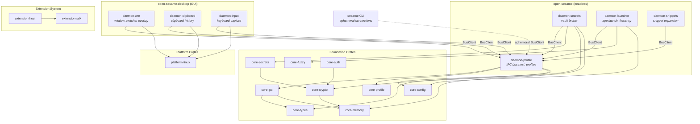

# Architecture Overview

Open Sesame is a trust-scoped secret and identity fabric for Linux, built as 21 Rust crates
organized into a Cargo workspace. The system runs as seven cooperating daemons under systemd,
communicating over a Noise IK encrypted IPC bus. Two Debian packages partition the daemons into
a headless core suitable for servers, containers, and VMs, and a desktop layer that requires a
Wayland compositor.

## Crate Topology

The workspace (`Cargo.toml:2-26`) contains 21 crates in five layers: memory and cryptographic
foundations, shared abstractions, platform bindings, daemon binaries, and the extension system.

### Foundation Layer

| Crate | Purpose |
|-------|---------|
| `core-memory` | Page-aligned secure memory allocator backed by `memfd_secret(2)` |
| `core-crypto` | Cryptographic primitives: AES-256-GCM, Argon2id, SecureBytes, EncryptedStore |
| `core-types` | Shared types, error types, and event schema for the IPC bus |

### Abstraction Layer

| Crate | Purpose |
|-------|---------|
| `core-config` | Configuration schema, validation, hot-reload, and policy override |
| `core-ipc` | IPC bus protocol, postcard framing, BusServer/BusClient |
| `core-fuzzy` | Fuzzy matching (nucleo), frecency scoring, FTS5, and index abstractions |
| `core-secrets` | Secret storage abstraction over platform keystores and age-encrypted vaults |
| `core-profile` | Profile schema, context-driven activation, isolation contracts, and atomic switching |
| `core-auth` | Pluggable authentication backends for vault unlock (password, SSH-agent, future FIDO2) |

### Platform Layer

| Crate | Purpose |
|-------|---------|
| `platform-linux` | Linux API wrappers: evdev, uinput, Wayland protocols, D-Bus, Landlock, seccomp |
| `platform-macos` | macOS API wrappers: Accessibility, CGEventTap, NSPasteboard, Keychain, LaunchAgent |
| `platform-windows` | Windows API wrappers: Win32 hooks, UI Automation, Credential Manager, Group Policy |

### Daemon Layer

| Crate | Purpose |
|-------|---------|
| `daemon-profile` | Profile orchestrator daemon: hosts IPC bus server, context evaluation, concurrent profile activation |
| `daemon-secrets` | Secrets broker daemon: JIT delivery, keyring integration, profile-scoped access |
| `daemon-launcher` | Application launcher daemon: fuzzy search, frecency, overlay UI, desktop entry discovery |
| `daemon-snippets` | Snippet expansion daemon: template rendering, variable substitution, secret injection |
| `daemon-wm` | Window manager daemon: Wayland overlay window switcher with letter-hint navigation |
| `daemon-clipboard` | Clipboard manager daemon: history, encryption, sensitivity detection, profile scoping |
| `daemon-input` | Input remapper daemon: keyboard layers, app-aware rules, macro expansion |

### Orchestration and Extension Layer

| Crate | Purpose |
|-------|---------|
| `open-sesame` | The `sesame` CLI binary: platform orchestration for multi-agent desktop control |
| `sesame-workspace` | Workspace-level integration utilities shared across daemons |
| `extension-host` | WASM extension host: wasmtime runtime, capability sandbox, extension lifecycle |
| `extension-sdk` | Extension SDK: types, host function bindings, and WIT interfaces for extensions |

## Daemon Model

The seven daemons are split across two systemd targets and two Debian packages.

### Headless Daemons (package: `open-sesame`)

These four daemons have no GUI dependencies and run on any system with systemd:
bare-metal servers, containers, VMs, and desktops alike.

| Daemon | Role |
|--------|------|
| **daemon-profile** | The IPC bus host. Manages trust profiles, evaluates context rules (WiFi network, connected hardware), performs atomic profile switching, and hosts the `BusServer` that all other daemons connect to. |
| **daemon-secrets** | Secrets broker. Manages SQLCipher-encrypted vaults scoped to trust profiles. Delivers secrets just-in-time to authorized callers over the IPC bus. Enforces per-vault ACLs and rate limiting. |
| **daemon-launcher** | Application launcher. Discovers `.desktop` entries, maintains frecency rankings per profile, and launches applications with optional secret injection as environment variables. |
| **daemon-snippets** | Snippet expansion engine. Renders templates with variable substitution and secret injection. |

### Desktop Daemons (package: `open-sesame-desktop`)

These three daemons require a COSMIC or Wayland compositor. The `open-sesame-desktop`
package depends on `open-sesame`, so installing it pulls in all headless daemons
automatically.

| Daemon | Role |
|--------|------|
| **daemon-wm** | Window manager overlay. Renders the Alt+Tab window switcher with letter-hint navigation via Wayland layer-shell protocols. |
| **daemon-clipboard** | Clipboard manager. Monitors Wayland clipboard events, maintains encrypted history per profile, detects sensitive content (passwords, tokens), and auto-expires sensitive entries. |
| **daemon-input** | Input remapper. Captures keyboard events via evdev, evaluates compositor-independent shortcut bindings, routes key events to other daemons over the IPC bus. |

### Headless/Desktop Split Rationale

The split exists so that secret management, application launching, and snippet expansion
can run on headless infrastructure (CI runners, jump hosts, fleet nodes) without pulling
in Wayland, GTK, or GPU dependencies. A server running only `open-sesame` gets encrypted
vaults, profile-scoped secrets, and environment injection
(`sesame env -p work -- aws s3 ls`) with no graphical stack. A developer workstation
installs `open-sesame-desktop` for the full experience: window switching, clipboard
history, and keyboard shortcuts layered on top of the same headless core.

## IPC Bus

All inter-daemon communication flows through a Noise IK encrypted IPC bus
implemented in `core-ipc`.

### Hub-and-Spoke Topology

`daemon-profile` hosts the `BusServer`. Every other daemon and every `sesame` CLI
invocation connects as a `BusClient`. There is no peer-to-peer communication between
daemons; all messages route through the hub.

### Noise IK Transport

The IPC bus uses the [Noise IK](https://noiseprotocol.org/) handshake pattern from
the `snow` crate (`Cargo.toml:89`). In the IK pattern the initiator (client) knows
the responder's (server's) static public key before the handshake begins. This provides
mutual authentication and forward secrecy on every connection. Messages are framed with
postcard (`Cargo.toml:65`) for compact binary serialization and deserialized into
`core-types::EventKind` variants.

### Ephemeral CLI Connections

The `sesame` CLI binary does not maintain a long-lived connection. Each CLI invocation
opens a Noise IK session to `daemon-profile`, sends one or more `EventKind` messages,
receives the response, and disconnects. The CLI has no persistent state and can be
invoked from scripts, cron jobs, or CI pipelines without session management.

### Message Flow Example

A `sesame secret get -p work aws-access-key` invocation follows this path:

1. `sesame` CLI opens a Noise IK session to `daemon-profile`.
2. `daemon-profile` authenticates the client and routes the secret-get request to `daemon-secrets`.
3. `daemon-secrets` verifies the caller's clearance against the vault ACL, decrypts the value from the
   SQLCipher store, and returns it as a `SensitiveBytes` payload.
4. `daemon-profile` forwards the response to the CLI.
5. The CLI writes the secret to stdout and exits.

All secret material in transit is encrypted by the Noise session. All secret material
at rest in daemon memory is held in `ProtectedAlloc` pages backed by `memfd_secret(2)`
(see [Memory Protection](./memory-protection.md)).

## Daemon Topology

## Crate Dependency Highlights

- Every daemon depends on `core-ipc` (for bus connectivity) and `core-types`
  (for the `EventKind` protocol schema).
- `core-ipc` depends on `core-memory` because Noise session keys are held
  in `ProtectedAlloc`.
- `core-crypto` depends on `core-memory` because `SecureBytes` wraps
  `ProtectedAlloc` for key material.
- The three desktop daemons (`daemon-wm`, `daemon-clipboard`, `daemon-input`)
  depend on `platform-linux` for Wayland protocol bindings, evdev access,
  and compositor integration.
- `core-secrets` depends on `core-crypto` for vault encryption and `core-auth`
  depends on `core-crypto` for key derivation during authentication.
- The `extension-host` crate uses `wasmtime` (`Cargo.toml:164`) with the
  component model and pooling allocator for sandboxed WASM extension execution.

## Security Boundaries

Each daemon runs as a separate systemd service with:

- **Landlock** filesystem restrictions (`platform-linux`, `landlock` crate at
  `Cargo.toml:136`) limiting each daemon to only the filesystem paths it needs.
- **seccomp** syscall filtering (`platform-linux`, `libseccomp` crate at
  `Cargo.toml:137`) restricting each daemon to a minimal syscall allowlist.
- **Noise IK** mutual authentication on every IPC connection, preventing
  unauthorized processes from joining the bus.
- **ProtectedAlloc** secure memory for all key material, with `memfd_secret(2)`
  removing secret pages from the kernel direct map
  (see [Memory Protection](./memory-protection.md)).

## See Also

- [Memory Protection](./memory-protection.md) -- secure memory allocator internals
- [IPC Protocol](./ipc-protocol.md) -- Noise IK handshake, framing, and message schema
- [Sandbox Model](./sandbox-model.md) -- Landlock and seccomp configuration
- [Profile Trust Model](./profile-trust-model.md) -- profile isolation contracts
